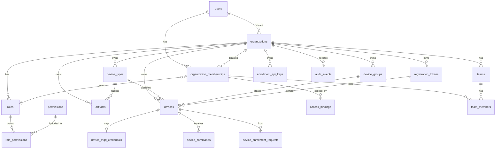

# MeteorCloud

**Self-hosted fleet platform for Linux devices.**

MeteorCloud is the control plane, operator console, MQTT data plane, and device agent for managing edge fleets you own. Enroll devices, organize them by type and group, ship artifacts, run commands over MQTT, and keep operator access multi-tenant and auditable — without sending device data to a third-party SaaS.

The public marketing site and product docs UI live in a separate Next.js app: [`meteor-edge/meteor-ui`](https://github.com/meteor-edge/meteor-ui).

[](LICENSE)

## Why MeteorCloud

| | |
| --- | --- |
| **You host it** | Docker Compose on a VM/EC2, or Helm on a cluster you already run |
| **Multi-tenant** | Organizations, memberships, RBAC, and optional device-group scopes |
| **Device lifecycle** | Registration tokens, device-initiated enrollment, heartbeat, inventory |
| **MQTT-ready** | TLS broker (EMQX), per-device credentials, ACL, ingest, live telemetry |
| **Artifacts** | OS images, firmware, compose bundles — metadata in Postgres, blobs in filesystem or S3 |
| **Replaceable infra** | PostgreSQL required; Redis, MQTT, and object storage selected by config |

## Product overview

Operators use the **console** against the **control plane** API. Devices run **meteorcli** (device-plane agent) and talk over HTTPS and optionally MQTT. The **data plane** owns the platform MQTT session and forwards inbound messages into the control plane.

```text
Browser ──► Console ──► Control plane (FastAPI) ──► PostgreSQL
                              │                         Redis (optional)
                              │                         Object storage (filesystem or S3)
meteor-agent HTTPS ───────────┤
                              │
meteor-agent MQTT ──► EMQX ───┼── HTTP auth/authorize
                              │
Control plane ── HTTP publish/watch ──► Data plane ── MQTT ──► EMQX
Data plane ── HTTP ingest ────────────► Control plane
```

### Modules

| Module | Path | Role |
| --- | --- | --- |
| Control plane | `src/control-plane/` | Identity, organizations, device registry, enrollment, artifacts, MQTT policy and ingest, operator API |
| Data plane | `src/data-plane/` | EMQX platform client: publish, subscribe, forward inbound MQTT to the control plane |
| Console | `console/` | Operator UI (browser talks only to the control-plane API) |
| Device plane | `src/device-plane/agent/` | On-device agent (`meteorcli`); runs on devices, not deployed by MeteorCloud |

## Data schema

PostgreSQL is the system of record for the control plane. Artifact **binaries** live in object storage; the database stores metadata and a `storage_key` only.



### Core tables

| Area | Tables |
| --- | --- |
| Identity & tenancy | `users`, `organizations`, `organization_memberships`, `teams`, `team_members` |
| Authorization | `permissions`, `roles`, `role_permissions`, `access_bindings` |
| Fleet | `device_types`, `device_groups`, `devices`, `registration_tokens`, `enrollment_api_keys`, `device_enrollment_requests` |
| Connectivity | `device_mqtt_credentials`, `device_commands` |
| Artifacts | `artifacts` (blob in filesystem/S3) |
| Audit | `audit_events` |

Tenant isolation is organization-scoped: fleet and artifact queries are filtered by membership. Device connectivity status is derived from `last_seen_at` rather than a separate status enum.

More detail: [docs/architecture.md](docs/architecture.md), [docs/identity-and-organizations.md](docs/identity-and-organizations.md).

## Quick start (local)

```bash
cp deploy/compose/.env.example deploy/compose/.env   # make dev does this if missing
make dev
make seed      # optional: owner@example.com / dev-password-123
```

| Surface | URL |
| --- | --- |
| Console | http://localhost:5173 |
| Control plane | http://localhost:8000 |
| OpenAPI | http://localhost:8000/docs |
| Data plane health | http://localhost:8081/health |
| MQTT TLS | mqtts://localhost:8883 |
| EMQX dashboard (dev) | http://localhost:18083 |

Choose bundled services with `COMPOSE_PROFILES` in `deploy/compose/.env` (`postgres`, `redis`, `minio`, `mqtt`, `emqx`). Start one module: `make dev-control-plane`, `make dev-data-plane`, `make dev-console`. Stop: `make stop`.

Kubernetes (local k3d + Helm):

```bash
make k8s-up && make k8s-deploy && make k8s-status
```

See [docs/development.md](docs/development.md).

## Deployment

Two independent paths; same images and settings.

| | Docker Compose + Ansible | Kubernetes + Helm |
| --- | --- | --- |
| For | One VM, EC2, or on-prem server | An existing cluster (k3s, GKE, EKS, AKS, …) |
| Files | [`deploy/compose/`](deploy/compose/), [`deploy/ansible/`](deploy/ansible/) | [`deploy/kubernetes/helm/meteorcloud/`](deploy/kubernetes/helm/meteorcloud/) |
| Install | `ansible-playbook playbooks/site.yml` (or `edge-installer apply` on AWS) | `helm upgrade --install` |
| Guide | [docs/deployment.md](docs/deployment.md) | [docs/kubernetes.md](docs/kubernetes.md) |

**MeteorCloud does not provision or manage Kubernetes clusters.** The Helm chart installs into a cluster you already have. Ansible only prepares servers and runs Compose; it never deploys to Kubernetes. Terraform ([`infrastructure/terraform/aws`](infrastructure/terraform/aws/)) creates the AWS EC2 host for the Compose path.

On AWS, `make up` (or `edge-installer apply`) runs Terraform then Ansible. Fresh-instance proof: GitHub Actions → **EC2 smoke test** ([docs/aws-ci.md](docs/aws-ci.md)).

### Dependencies

| Dependency | Status | Options |
| --- | --- | --- |
| PostgreSQL | Required | Bundled container, or external |
| Artifact storage | Required | Filesystem volume, AWS S3, or any S3-compatible API |
| MQTT broker | Optional | Bundled or external EMQX; off by default |
| Redis | Optional | Shared rate limits across API replicas; in-memory otherwise |
| Kafka, ClickHouse | Not used | Not deployed |

The smallest install runs PostgreSQL, the API, the console, and a reverse proxy (Traefik with Compose, your ingress with Kubernetes).

## Repository layout

```text
├── src/
│   ├── control-plane/          # FastAPI (app.*), Dockerfile
│   ├── data-plane/             # MQTT gateway (data_plane.*), Dockerfile
│   └── device-plane/agent/     # meteorcli
├── console/                    # operator UI, Dockerfile (nginx)
├── deploy/
│   ├── compose/                # Docker Compose files, .env.example
│   ├── ansible/                # server preparation + Compose deployment
│   └── kubernetes/helm/        # Helm chart
├── infrastructure/
│   ├── terraform/aws/          # EC2 host for the Compose path
│   └── installer/              # edge-installer (Terraform + Ansible on AWS)
├── contracts/                  # HTTP JSON between planes
├── scripts/                    # smoke tests, certificates, CI helpers
├── docs/
└── Makefile
```

## Documentation

| Doc | Topic |
| --- | --- |
| [Architecture](docs/architecture.md) | Modules, providers, HTTP/MQTT split |
| [Development](docs/development.md) | Local Compose, env, coding standards |
| [Identity & organizations](docs/identity-and-organizations.md) | Users, tenants, RBAC |
| [Deployment](docs/deployment.md) | Compose + Ansible |
| [Kubernetes](docs/kubernetes.md) | Helm on existing clusters |
| [Fleet docs](docs/fleet/) | Enrollment, heartbeat, MQTT, artifacts |
| [Docs index](docs/README.md) | Full list |

Operator-facing product docs are also served by the website (`VITE_DOCS_BASE_URL`). See [docs/frontends.md](docs/frontends.md).

## License

Copyright © Meteor Edge contributors.

Licensed under the [Apache License, Version 2.0](LICENSE).

```text
Licensed under the Apache License, Version 2.0 (the "License");
you may not use this file except in compliance with the License.
You may obtain a copy of the License at

    http://www.apache.org/licenses/LICENSE-2.0

Unless required by applicable law or agreed to in writing, software
distributed under the License is distributed on an "AS IS" BASIS,
WITHOUT WARRANTIES OR CONDITIONS OF ANY KIND, either express or implied.
See the License for the specific language governing permissions and
limitations under the License.
```
